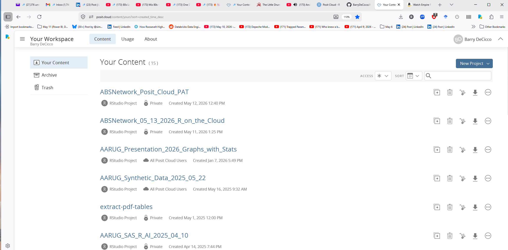
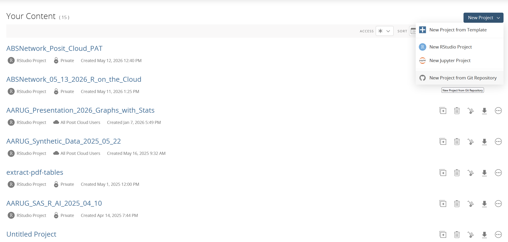
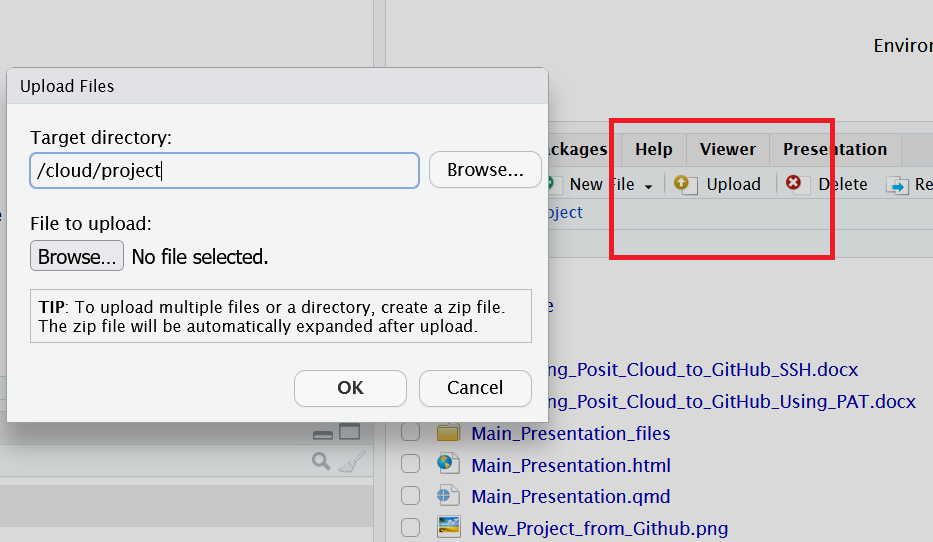

## Posit Cloud

Posit Cloud allows you to run RStudio projects completely on the web, with no local installations needed. You can upload and download files and data sets to and from your local computer.

You can also share projects with others, which allows collaboration, and makes teaching classes far easier. The students can start with the same setup, saving setup time.

## Getting Posit Cloud

-   Go to [Posit.cloud](https://posit.cloud)

-   Sign up for a free account.

You will see your workspace (mine is full; yours will be empty):

{width="80%"}

## Creating a Project from Github

You can create a project from a Github repository, to get all of the advantages of Github in addition to those of Posit Cloud:

{width="80%"}

## Connecting to Github - SSH and PAT

It's good to be able to push changes to the repository. I have included documentation of two methods of connecting which allow the user to push changes (they will be made available later):

-   Connecting_Posit_Cloud_to_GitHub_SSH.docx

-   Connecting_Posit_Cloud_to_GitHub_Using_PAT.docx

## Navigating the interface:

The interface is very much like the desktop version of RStudio, with a few changes:

-   The lower right panel has commands to upload and export files.

-   The session is running on a Linux box somewhere, and not your PC; you can issue the command 'uname -a' to see information about this linux box. Also, the path is '/cloud/project',

## Importing files:

To get files from your PC to the project, use the 'Upload' button, and select
your file:

{width="80%"}

